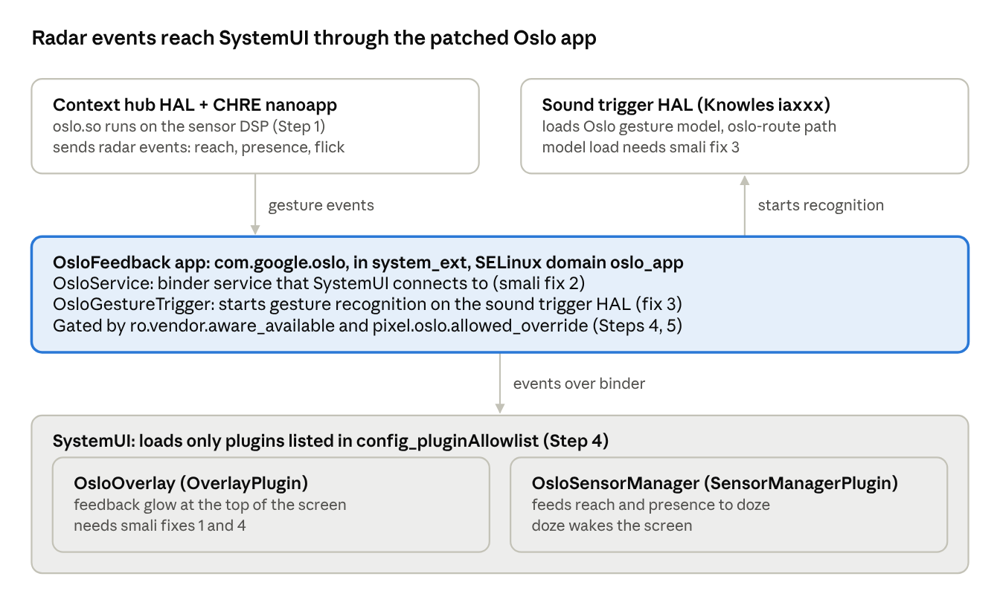

# Motion Sense on Android 17: Porting Guide

_Last updated: October 4, 2026_

Motion Sense (Soli radar, codename Oslo) runs on Android 17 on the Pixel 4 XL (coral) with Google's Android 13 OsloFeedback APK, four small smali patches and a handful of device-tree changes. This guide lists every piece, in the order to add them, as done for Project Infinity X 17 (based on LineageOS 24.0).

## How it works



The radar nanoapp and the Knowles chip talk to the OsloFeedback app, which passes gestures to two SystemUI plugins. Every Android 17 fix in this guide sits on one of these boxes.

## What you need

You need a working Android 17 ROM for coral or flame that already boots on the stock Android 13 vendor blobs, plus the pieces below.

| Item | Where to get it | Notes |
| --- | --- | --- |
| Device and vendor trees | Your ROM's coral trees (LineageOS 24.0 based) | Must use the final stock vendor, TP1A.221005.002.B2 |
| OsloFeedback source (smali) | [its-hecker/infinity_OsloFeedback](https://github.com/its-hecker/infinity_OsloFeedback), branch cnb | Aswin's Android 14 smali import plus the four Android 17 fixes |
| OsloFeedback.apk and MotionSenseBridgePrebuilt.apk | Built from the repo above / [PixysOS-Devices/vendor_google_coral](https://github.com/PixysOS-Devices/vendor_google_coral) (fourteen-v3) | MotionSenseBridge is a 16 KB stub, use it unchanged |
| APKEditor | [REAndroid/APKEditor](https://github.com/REAndroid/APKEditor) releases | Rebuilds the APK from smali |
| Settings patch (optional) | Forward port of PixysOS commit c50735fc0f | Adds the Motion Sense pages in Settings |

The kernel needs no changes: the Soli and Knowles (iaxxx) drivers in the msm-4.14 coral kernel already work.

## Step 1: Vendor blobs, firmware and the CHRE nanoapp

Most Lineage-based coral vendor trees already ship these. Check each one is listed in `proprietary-files-vendor.txt` and copied by `coral-vendor.mk`.

| File | Purpose |
| --- | --- |
| `vendor/dsp/sdsp/oslo.so`, `oslo.napp_header` | Oslo nanoapp that runs on CHRE in the sensor DSP |
| `vendor/etc/chre/preloaded_nanoapps.json` | Must list `"oslo"` |
| `vendor/firmware/OsloSensorConfig.bin`, `OsloSensorPackage.bin` | Soli radar firmware |
| `vendor/firmware/BufferConfigValOslo.bin` | Knowles iaxxx buffer config for the Oslo route |
| `audio/sound_trigger_mixer_paths_*.xml` (device tree) | Contain the `oslo-route` path |

The device tree must also build these from source, which Lineage trees already do:

- `chre_daemon_msm` and `android.hardware.contexthub-service.generic` (context hub HAL)
- `android.hardware.soundtrigger@2.3-impl` and `sound_trigger.primary.msmnile` (Knowles sound trigger HAL)
- `init.hardware.rc` rules that create `/mnt/vendor/persist/oslo` and set permissions on `oslo.cal` and `tx_power.cal`

## Step 2: The two prebuilt APKs

OsloFeedback (`com.google.oslo`) is a SystemUI plugin plus the Oslo service. MotionSenseBridge only holds a permission and contains no code. Do not list either APK in `proprietary-files.txt`: extract-files would look for them in the stock image.

Add them to the vendor tree's `Android.bp`:

```
android_app_import {
    name: "OsloFeedback",
    owner: "google",
    apk: "proprietary/system_ext/priv-app/OsloFeedback/OsloFeedback.apk",
    certificate: "platform",
    dex_preopt: {
        enabled: false,
    },
    privileged: true,
    system_ext_specific: true,
}

android_app_import {
    name: "MotionSenseBridgePrebuilt",
    owner: "google",
    apk: "proprietary/product/app/MotionSenseBridgePrebuilt/MotionSenseBridgePrebuilt.apk",
    preprocessed: true,
    presigned: true,
    dex_preopt: {
        enabled: false,
    },
    product_specific: true,
}
```

Then add `OsloFeedback` and `MotionSenseBridgePrebuilt` to `PRODUCT_PACKAGES` in `coral-vendor.mk`. `certificate: "platform"` re-signs OsloFeedback with your platform key, so you cannot test a rebuilt APK with `adb install`; it has to go through a ROM build.

Add a privapp allowlist block for `com.google.oslo` with: ACCESS_CONTEXT_HUB, CAPTURE_AUDIO_HOTWORD, MANAGE_SOUND_TRIGGER, MANAGE_USERS, MEDIA_CONTENT_CONTROL, MODIFY_AUDIO_ROUTING, MODIFY_PHONE_STATE, READ_DEVICE_CONFIG, RECEIVE_BOOT_COMPLETED, RECORD_AUDIO, START_ACTIVITIES_FROM_BACKGROUND, USER_ACTIVITY and WRITE_SECURE_SETTINGS (all `android.permission.*`). A missing entry stops the device from booting.

## Step 3: The four smali fixes for Android 17

Start from Aswin's Android 14 smali (it already handles the DarkReceiver v3 and `getTint(Collection…)` changes). Android 17 needs four more fixes; without any one of them SystemUI crash-loops or the gestures never start.

| # | File (under `smali/classes/com/google/oslo/`) | Symptom on Android 17 | Fix |
| --- | --- | --- | --- |
| 1 | `OsloOverlay.smali`, `addViews()` | `IncompatibleClassChangeError`: SystemUI's `PluginDependency` is now a Kotlin `object`, so `get()` is no longer static | Replace both `invoke-static PluginDependency;->get` calls with `sget-object v3, …PluginDependency;->INSTANCE` + `invoke-virtual {v3, p0, v0}, …;->get(…)` |
| 2 | `service/OsloService.smali`, `checkPermission()` | `SecurityException: Must have …RESTRICTED_ASSIST_GESTURE_PROVIDER`: only Google's SystemUI requests that permission | Check `android.permission.STATUS_BAR_SERVICE` instead: a signature permission AOSP SystemUI already holds |
| 3 | `service/OsloGestureTrigger.smali`, `loadGesturePlugin()` | `START_RECOGNITION ERROR: Invalid sound model`: since Android 14 the detector copies the model when it is created, which Oslo does before saving it | After `updateModel()`, create a new `DetectorCallback` and detector and store it in `mGestureTriggerDetector`; drop `final` from that field |
| 4 | `OsloOverlay$Minimizer.smali`, `addInteractionListeners()` | `NoSuchMethodError: InputManager.getInstance()` (removed in Android 14) | Call `InputManagerGlobal.getInstance()` and `InputManagerGlobal;->monitorGestureInput(String, int)` instead |

The finished patches are commits on [its-hecker/infinity_OsloFeedback](https://github.com/its-hecker/infinity_OsloFeedback) (cnb), so you can cherry-pick them instead of editing by hand. Fix 1 example:

```
# before
invoke-static {p0, v0}, Lcom/android/systemui/plugins/PluginDependency;->get(Lcom/android/systemui/plugins/Plugin;Ljava/lang/Class;)Ljava/lang/Object;

# after
sget-object v3, Lcom/android/systemui/plugins/PluginDependency;->INSTANCE:Lcom/android/systemui/plugins/PluginDependency;
invoke-virtual {v3, p0, v0}, Lcom/android/systemui/plugins/PluginDependency;->get(Lcom/android/systemui/plugins/Plugin;Ljava/lang/Class;)Ljava/lang/Object;
```

Rebuild with `java -jar APKEditor.jar b -i infinity_OsloFeedback -o OsloFeedback.apk`. Delete the `.cache/` folder first: APKEditor builds from the cached dex files and silently ignores smali edits if they are there. Check the result with `apktool d -r` before copying it into the vendor tree.

A plugin's own copies of `com.android.systemui.plugin*` classes are ignored at runtime, because SystemUI loads its own. What matters is that the `@Requires` versions and the methods Oslo calls match SystemUI's. On Android 17 those versions are OverlayPlugin 4, DarkReceiver 3, DarkIconDispatcher 2, StatusBarStateController 1 and SensorManagerPlugin 1, all unchanged from Android 14.

## Step 4: Device tree props, overlays and permissions

The SystemUI plugin allowlist is the step most ports get wrong, because the ROM's own vendor overlay usually overrides it.

**Properties**

| Property | File | Value | Why |
| --- | --- | --- | --- |
| `ro.vendor.aware_available` | `vendor.prop` | `true` | Oslo and the Settings pages treat the device as supported. Also needs the SELinux rule in Step 5, or it is silently never set |
| `pixel.oslo.allowed_override` | `product.prop` | `1` | Bypasses Google's country list (Oslo logs `by country: false, by country override: true`) |
| `pixel.oslo.airplane_mode.allowed_override` | `product.prop` | `1` | Optional: keeps Oslo on in airplane mode |

Do **not** set `pixel.oslo.gating`. It is not a bypass: Oslo reads it as an integer (default 4) and sends it to the radar nanoapp.

**SystemUI plugin allowlist**

On `user` builds SystemUI loads only plugins listed in `config_pluginAllowlist`; otherwise logcat shows `Plugin cannot be loaded in production`. Product overlays win over device overlays and arrays are replaced, not merged. So if your ROM's vendor repo already defines this array (Infinity X does in `vendor/infinity/overlay/common`), a device overlay is ignored. Copy the ROM's full list plus `com.google.oslo` into a separate folder, and add that folder to the front of the product overlays in `device-common.mk`:

```xml
<!-- overlay-oslo/frameworks/base/packages/SystemUI/res/values/config.xml -->
<string-array name="config_pluginAllowlist" translatable="false">
    <item>com.android.systemui</item>
    <!-- ...every item from your ROM's own list... -->
    <item>com.google.oslo</item>
</string-array>
```

```make
PRODUCT_PACKAGE_OVERLAYS := $(LOCAL_PATH)/overlay-oslo $(PRODUCT_PACKAGE_OVERLAYS)
```

After building, `grep -rl com.google.oslo out/target/product/coral/product/overlay/` should list the SystemUI RRO.

Because the allowlist makes Oslo a privileged plugin, SystemUI will not disable it after repeated crashes (`Ignoring request to disable privileged plugin`). A broken OsloFeedback therefore causes an endless SystemUI loop; recover with `adb shell pm uninstall -k --user 0 com.google.oslo` and bring it back later with `adb shell cmd package install-existing com.google.oslo`.

**Other config**

- `config_dozeWakeLockScreenSensorAvailable` = `true` in the framework overlay (reach to wake)
- Default-permission exception for `com.google.oslo`: `RECORD_AUDIO`
- Optional: `oslo/media_app_whitelist=…` in the SimpleDeviceConfig overlay, to add music players that the skip gesture should control

## Step 5: SELinux policy

OsloFeedback lives in `system_ext`, so `oslo_app` must be a `coredomain`. System_ext policy is compiled without vendor types, though, so split the rules between the two sides. Test on an enforcing build: Oslo's domain only half-works if a rule is missing.

| File | Contents |
| --- | --- |
| `sepolicy/system_ext/public/oslo_app.te` | `type oslo_app, domain, coredomain;` |
| `sepolicy/system_ext/private/oslo_app.te` | `app_domain(oslo_app)`, stats and binder rules, `find` on app_api / audioserver / mediaserver / radio services, `typeattribute oslo_app system_writes_mnt_vendor_violators;`, `allow oslo_app mnt_vendor_file:dir search;`, `get_prop(oslo_app, pixel_oslo_debug_prop)` |
| `sepolicy/vendor/google/oslo_app.te` | `allow oslo_app persist_file:dir search;`, `r_dir_file(oslo_app, persist_oslo_file)`, `get_prop(oslo_app, vendor_aware_available_prop)` |
| `sepolicy/system_ext/private/seapp_contexts` | `user=_app seinfo=platform name=com.google.oslo domain=oslo_app type=app_data_file levelFrom=all` |
| `sepolicy/system_ext/public/property.te` | `system_internal_prop(pixel_oslo_debug_prop)` (not `vendor_internal_prop`: a coredomain may not read vendor-internal props) |
| `sepolicy/vendor/google/vendor_init.te` | `set_prop(vendor_init, vendor_aware_available_prop)` |

The last rule is easy to miss. Without it boot logs `avc: denied { set } for property=ro.vendor.aware_available scontext=u:r:vendor_init:s0`, and the property stays unset.

Test only the policy before a full build, which takes a few minutes instead of an hour:

```
m selinux_policy
```

If logcat shows no `avc:` lines at all, that does not mean there are no denials. KernelSU's `selinux_hide` can hide them; use `adb logcat -b all -d` and search for `avc:`.

## Step 6 (optional): Motion Sense pages in Settings

AOSP Settings has no Motion Sense UI, so without this step you turn it on with `adb`. The Settings patch is a forward port of PixysOS commit c50735fc0f (Aswin, reverse-engineered from SettingsGoogle). It adds System → Motion Sense, the Quick Gestures entries under Gestures, and the presence and reach entries on the Lock screen page.

Changes needed on Android 17 compared with the Android 14 commit:

- `AmbientDisplayAlwaysOnPreferenceController` was renamed `AmbientDisplayAlwaysOnPreferenceScreenController`
- remove the decompiler's `/* bridge */` methods in `AwareDisplayPreferenceController` and the dialog preferences; they call super methods that no longer exist
- restore assets and the `doze_always_on_title` string that AOSP deleted
- make `awareFeatureProvider` an `open val` with a default in `FeatureFactory.kt`, so other subclasses still build
- keep only `com.google.android.settings.aware.**` in `proguard.flags`

The pages show only when `ro.vendor.aware_available` is true. That property also hides the stock Always-on display toggle, which comes back through these pages. The code is reverse-engineered from a Google app, so keep the Settings fork that carries it private.

Without the Settings pages, turn features on from `adb`:

```
adb shell settings put secure aware_enabled 1
adb shell settings put secure skip_gesture 1
adb shell settings put secure silence_gesture 1
adb shell settings put secure doze_wake_display_gesture 1
adb shell settings put secure doze_wake_lock_screen_gesture 1
```

## Testing

Capture logs within a minute or two of boot, before the buffer drops Oslo's startup lines. On Windows use `findstr` instead of `grep`, or save the whole log and search it later.

```
adb shell getprop ro.vendor.aware_available
adb logcat -b crash -d > crash.txt
adb logcat -d > oslo.txt
adb logcat -b all -d | grep "avc:"
```

| Check | Log line that means it works |
| --- | --- |
| Property set | `getprop` prints `true` |
| Plugin loaded | `PluginInstance[.OsloOverlay]…: Loaded plugin; running callbacks` (and the same for `.OsloSensorManager`) |
| Oslo enabled | `Oslo.OsloMetrics: … mIsEnabled = true` |
| Gesture engine running | `SoundTriggerHelper: startRecognition successful.` |
| Radar reaching the app | `Oslo.ReachGestureSensor: Reach received: detected=true … distance=0.07…` |
| Doze subscribed | `Oslo.OsloMetrics: log reach client SystemUI gesture 4 register true` |

Then test each gesture by hand:

- [ ] Skip track: swipe left or right over the phone while music plays in a supported app. The log shows `flick subscribers: 1, active subscriber: …SkipMediaTrack` only while such an app is playing
- [ ] Reach to wake: reach for the phone with the screen off
- [ ] Presence: with Always-on display on, the screen stays on while you are near
- [ ] Silence: wave at a ringing alarm, timer or call (alarm and call silencing may need Google Clock and Google Phone)
- [ ] Feedback glow at the top of the screen when Oslo sees you

These lines are harmless and can be ignored: `sound_trigger_hw_call_back: Unknown event 16/17`, `Incomplete frame received`, `Model … already started`, and `Unload error: Attempting unload invalid generic model`.

## Troubleshooting

Every error below came up during the Infinity X port, in the order it appeared. Each fix is in the step shown.

| Error | Where it shows | Cause | Fix |
| --- | --- | --- | --- |
| `unknown type persist_oslo_file` / `unknown type persist_file` | Build, `system_ext_sepolicy.cil` | system_ext policy refers to vendor-only types | Move those rules to `vendor/google/oslo_app.te` (Step 5) |
| neverallow on `oslo_app pixel_oslo_debug_prop:file read` | Build, `sepolicy_neverallows` | coredomain reading a `vendor_internal_prop` | Make it `system_internal_prop` (Step 5) |
| neverallow on `oslo_app mnt_vendor_file:dir search` | Build, `sepolicy_neverallows` | Platform domains may not touch `/mnt/vendor` | `typeattribute oslo_app system_writes_mnt_vendor_violators;` (Step 5) |
| `Plugin cannot be loaded in production` | Logcat | `com.google.oslo` not in the allowlist that wins | Product overlay prepended to `PRODUCT_PACKAGE_OVERLAYS` (Step 4) |
| `IncompatibleClassChangeError` on `PluginDependency.get` | SystemUI crash loop | `PluginDependency` is a Kotlin object on Android 17 | Smali fix 1 (Step 3) |
| `SecurityException: Must have …RESTRICTED_ASSIST_GESTURE_PROVIDER` | SystemUI crash loop, in `OsloServiceManager.registerListener` | AOSP SystemUI lacks Google's permission | Smali fix 2 (Step 3) |
| `START_RECOGNITION ERROR: Invalid sound model` | Logcat, `SoundTriggerService` | Detector created before the model is saved | Smali fix 3 (Step 3) |
| `NoSuchMethodError: InputManager.getInstance()` | SystemUI crash loop, in `OsloOverlay$Minimizer` | Method removed in Android 14 | Smali fix 4 (Step 3) |
| `avc: denied { set } for property=ro.vendor.aware_available` | Boot log (`logcat -b all`) | `vendor_init` cannot set the property | `set_prop(vendor_init, vendor_aware_available_prop)` (Step 5) |
| `Shell cannot change component state` | `adb shell pm disable com.google.oslo` | Shell cannot disable a privileged system app | Use `pm uninstall -k --user 0`, undo with `cmd package install-existing` |
| Smali edits have no effect | Rebuilt APK | APKEditor reuses stale `.cache/` dex files | Delete `.cache/` before every build (Step 3) |

Unrelated to Oslo but seen on the same builds: `keymaster@4.1-service.citadel` aborts with `stack corruption detected` in `export_key_der` about 43 s after each boot. It restarts on its own, but may affect apps that rely on hardware-backed keys.

## Credits and sources

- Dirty Unicorns developers, first Motion Sense port to a custom ROM (Android 10)
- [Aswin A S (aswin7469)](https://github.com/aswin7469), PixysOS Android 14 port: OsloFeedback smali import, DarkReceiver v3 and `getTint` fixes, Settings implementation
- Android 17 port for Project Infinity X: its-hecker

Sources:

- [its-hecker/infinity_OsloFeedback](https://github.com/its-hecker/infinity_OsloFeedback): smali with the Android 17 fixes
- [its-hecker/infinity_cnb_android_device_google_coral](https://github.com/its-hecker/infinity_cnb_android_device_google_coral): device tree (props, overlays, sepolicy)
- [its-hecker/infinity_cnb_proprietary_vendor_google_coral](https://github.com/its-hecker/infinity_cnb_proprietary_vendor_google_coral): vendor tree with the prebuilt APKs
- [PixysOS-Devices/vendor_google_coral](https://github.com/PixysOS-Devices/vendor_google_coral) (fourteen-v3) and [PixysOS-Devices/device_google_coral](https://github.com/PixysOS-Devices/device_google_coral): the Android 14 port
- [PixysOS/packages_apps_Settings](https://github.com/PixysOS/packages_apps_Settings) (fourteen-v3), commit c50735fc0f: the Motion Sense Settings pages
- [LineageOS/android_frameworks_base](https://github.com/LineageOS/android_frameworks_base/tree/lineage-24.0/packages/SystemUI/plugin/src/com/android/systemui/plugins) (lineage-24.0): the Android 17 SystemUI plugin interfaces checked against
- [XDA: PixysOS for Pixel 4 XL (Motion Sense)](https://xdaforums.com/t/pixysos-v7-3-3-for-pixel-4-xl-android-14-qpr3-motion-sense.4639899/)
